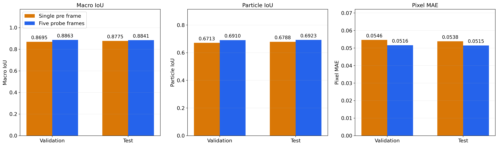
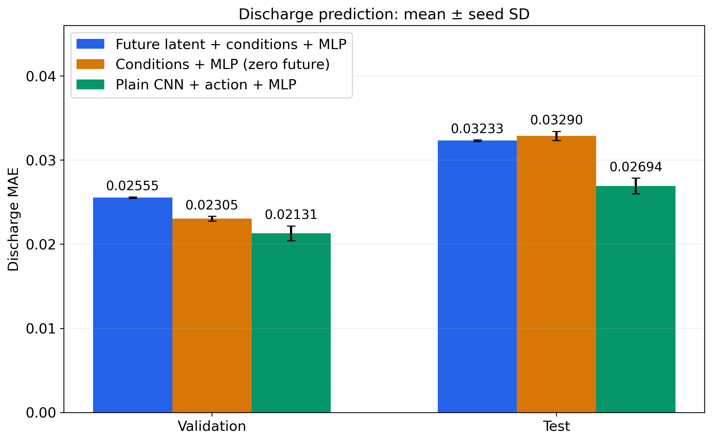
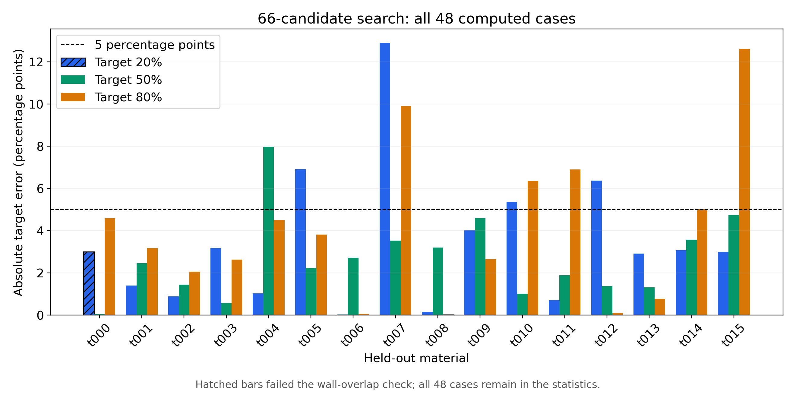
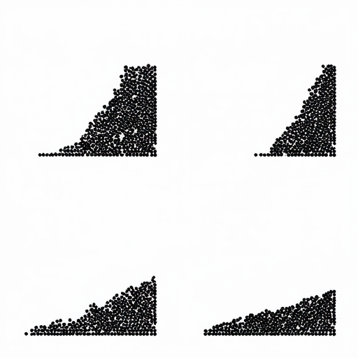
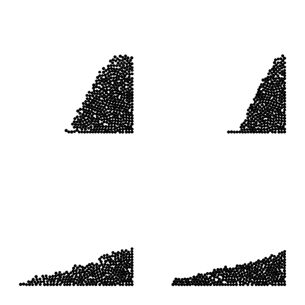

# ActivePour

**Active probing for granular pouring: conditional future prediction, frozen-feature readout, and training-free action search.**

ActivePour is a simulation-based research prototype connecting a physical manipulation problem to a pretrained generative model. A fixed probe exposes a granular bed to a small tilt. An action-conditioned **SD3.5 Medium** model predicts four future states of a subsequent pour. A small MLP reads discharge fraction from the frozen representation, and a coarse-to-local search selects an action for a requested discharge target.

This repository documents the **final selected configuration**: generation-condition dropout **0.05**, readout-MLP dropout **0.15**, and readout AdamW weight decay **0.001**. The future readout uses the **final sampled latent**, not a decoded density map or internal MMDiT hidden tokens.

## The three connected tasks

```text
GeoTaichi DEM
  ├─ five observed probe frames + action ──> SD3.5 future four-panel image
  └─ true mass discharge fraction                  │
                                                  ▼
                                  frozen conditions + final latent
                                                  │
                                      small discharge MLP
                                                  │
                         32 global + 5 x 6 local + 4 extra candidates
                                                  │
                           selected action ──> independent DEM verification
```

1. **Future prediction:** compare five-frame observations against `I_pre` only, with both models trained for 10,000 optimizer steps.
2. **Discharge readout:** compare frozen latent features, a zero-future-slot ablation, and an independently trained plain CNN baseline. All use the same 221,441-parameter MLP.
3. **Action selection:** use only the frozen five-frame model and the three latent-head seeds to score actions. No new policy training or simulation-feedback reselection.

## Why this problem?

Similar-looking granular beds can react differently to the same operation. A short controlled probe may reveal information unavailable from a single pre-probe image. Predicting the future also offers a richer intermediate representation than directly predicting one scalar.

The project asks whether that representation is useful and reusable—not whether adding a large generator must outperform a small regressor. The direct regression baseline is deliberately retained, and it is more accurate on discharge in this experiment.

## Results at a glance

### Future prediction

Both arms use the same future labels, whose physical rollout starts at `I_post`. The single-frame arm sees only `I_pre`; it does **not** receive a different rollout starting at `I_pre`.

| Input | Validation macro IoU | Test macro IoU | Test particle IoU | Test pixel MAE |
|---|---:|---:|---:|---:|
| `I_pre` + action | 0.869475 | 0.877457 | 0.678806 | 0.053819 |
| Five probe frames + action | **0.886286** | **0.884112** | **0.692252** | **0.051466** |

The improvement is modest. The comparison measures the benefit of observing the probe response **including the actual post-probe starting state**. It does not isolate the value of history beyond `I_post` alone.



### Discharge prediction

Each arm was trained for 10,000 steps with seeds 101, 202 and 303. Each seed uses its validation-selected checkpoint. Values below are mean results across independent seeds, **not ensemble predictions**.

| Readout | Validation MAE | Test MAE ± seed SD | Trainable parameters |
|---|---:|---:|---:|
| Final latent + frozen conditions + MLP | 0.025548 | 0.032331 ± 0.000100 | 221,441 |
| Zero future slot + frozen conditions + MLP | 0.023050 | 0.032902 ± 0.000548 | 221,441 |
| Plain CNN + action encoder + MLP | **0.021308** | **0.026938 ± 0.000936** | 397,441 |

`0.01` discharge MAE means **one percentage point**. Frozen features support a useful scalar readout, but do not beat direct regression. The latent-versus-zero difference is not conclusive. Only one downstream scalar was tested; general multi-task transfer is a future possibility, not an established result.



### Target-action selection

16 held-out materials × one probe state × targets 20%, 50%, 80% = **48 tasks**. Each task compares **66 candidates: 32 global + 5 diverse centers × 6 local + 4 extra global**. Sharing the first 32 across targets gives **2,144 unique candidate actions across the 16 states**. The generator and latent readout heads are unchanged; compatible cached predictions and unchanged-action simulations are reused.

| Reporting scope | Cases | Target MAE | Target RMSE | Within ±5 percentage points |
|---|---:|---:|---:|---:|
| All computed cases, without numerical filtering | 48 | **3.393 pp** | 4.513 pp | 38/48 (79.17%) |
| Numerically accepted cases only | 46 | 3.475 pp | 4.589 pp | 36/46 (78.26%) |

Two cases (`t000` at 20% and `t008` at 80%) failed the wall-overlap guard. They remain in the all-case view with their original failure flags. Counting those as failures gives **36/48 (75.00%)** numerically valid target successes. We do not relabel numerical failures as passes. No materials are excluded for poor prediction performance.

The earlier 52-candidate results remain in `results/planning_52_candidates.json`. This follow-up was performed after inspecting those results, not on a fresh blind test. All-case MAE improved from 3.817 to 3.393 pp, but RMSE did not improve (4.500 to 4.513 pp); a larger search does not remove model bias or guarantee better outcomes for each task.



One illustrative selected action (`t009`, 50% target; not a representative-sample guarantee):

| Predicted future | DEM verification |
|---|---|
|  |  |

## Architecture

The complete architecture is described in [docs/architecture.md](docs/architecture.md).

- **Backbone:** full SD3.5 Medium, 24 MMDiT blocks, image-side Q/K/V/O LoRA with rank 16 per adapted matrix. Original weights, text encoders and VAE are frozen.
- **Probe encoder:** each 256×256 grayscale frame passes through a shared `1→32→64→96→128` CNN, producing `128×16×16` features.
- **History fusion:** per-location, four-head attention reads absolute observations and differences from `I_pre`; a matched-stage difference bypass preserves responses directly.
- **Spatial base:** `F_post` for the five-frame model, `F_pre` for the single-frame model. Hidden observations are masked before the CNN and in attention.
- **Action conditioning:** a global `3→128→4096` token joins fixed text tokens; four stage-specific action descriptors also modulate query and feature maps using residual FiLM.
- **Injection:** stage features tile into a 32×32 grid, project to 1,024×1,536, and enter the image residual stream after blocks 0, 4, 8, 12, 16 and 20.
- **Readout:** 512 probe features + 128 action features + 1,024 pooled final-latent features = **1,664**, followed by the shared MLP architecture.

## Repository layout

```text
activepour_model/   final conditioner, explicit LoRA, flow objective, image conventions
activepour/         portable preparation, training, inference, readout and search CLIs
simulation/        GeoTaichi adapter and raw-particle renderer
configs/           final protocol and manifest schema example
results/           sanitized metrics, learning curves and all 48 planning records
assets/            result plots and an illustrative prediction/verification pair
tests/             CPU architecture, search and resumable readout smoke tests
reference/         original first-party generator packages for source audit
docs/              architecture, reproduction protocol and limitations
scripts/           result recomputation and static release checks
```

## Quick start: inspect and test without model weights

Python 3.11 is recommended. Install PyTorch for your platform, then:

```bash
python -m pip install -e .
python -m unittest discover -s tests -v
python scripts/summarize_results.py
python scripts/check_release.py
```

The source tests require PyTorch but do not download SD3.5 or run DEM. GitHub Actions runs the CPU tests. Scalar learning histories are in `results/learning_curves.json`; published figures are not substituted for the underlying scalar records.

Release validation: seven CPU tests passed, including exact readout resume, and an isolated full-SD3.5 check passed 28-step generation, 1,664-dimensional feature extraction and backward propagation without changing trained weights. A complete 10k-step retraining of the portable packaging and a new DEM production campaign were not run for this release.

## Model workflow

The public CLIs are a **portable refactoring** of the final methods. Archived results came from the source-locked experimental runs. The refactoring is not claimed to reproduce archived optimizer/RNG trajectories bit-for-bit. Existing private checkpoints are not overwritten or automatically migrated.

1. Obtain [SD3.5 Medium](https://huggingface.co/stabilityai/stable-diffusion-3.5-medium) separately, accept its applicable terms, and download the complete Diffusers-format model.
2. Install a CUDA-compatible PyTorch build and model dependencies (`python -m pip install -e '.[model]'`). Exact versions observed in the completed model experiment are recorded in `requirements-tested-model.txt`; broad optional dependency bounds are not a promise that every version is tested.
3. Prepare a manifest following `configs/manifest.example.json`. Its values are **schema placeholders**, not actual training labels. Supply real five-frame images, future grids and mass-discharge labels, with probe episodes kept in one split.

```bash
export CUBLAS_WORKSPACE_CONFIG=:4096:8
python -m activepour.prepare --model /path/to/sd35-medium \
  --manifest /path/to/manifest.json --root /path/to/images --out /path/to/banks

python -m activepour.train_generator --model /path/to/sd35-medium \
  --bank /path/to/banks --mode full5 --out /path/to/runs/full5
python -m activepour.train_generator --model /path/to/sd35-medium \
  --bank /path/to/banks --mode pre1 --out /path/to/runs/pre1

python -m activepour.cache_features --model /path/to/sd35-medium \
  --checkpoint /path/to/runs/full5/best.pt --bank /path/to/banks --out /path/to/features

python -m activepour.train_readout --bank /path/to/features --arm latent \
  --seed 101 --out /path/to/runs/latent101
python -m activepour.train_readout --bank /path/to/features --arm zero \
  --seed 101 --out /path/to/runs/zero101
python -m activepour.train_readout --bank /path/to/banks --arm direct \
  --seed 101 --out /path/to/runs/direct101

python -m activepour.evaluate --checkpoint /path/to/runs/latent101/best.pt \
  --bank /path/to/features/test.pt --out /path/to/results/latent101-test.json
```

Repeat readout training for seeds 202 and 303. `--resume` resumes a public run from `latest.pt` with optimizer and RNG state; use the same configuration. `--stop-after` ends at a specified absolute step while retaining the original total learning-rate schedule. Do not launch two writers against one run directory. Only load checkpoints you trust.

```bash
python -m activepour.plan --model /path/to/sd35-medium \
  --generator /path/to/runs/full5/best.pt \
  --heads /path/to/runs/latent101/best.pt /path/to/runs/latent202/best.pt /path/to/runs/latent303/best.pt \
  --bank /path/to/banks/test.pt --index 0 --target 0.5 --out /path/to/search
```

This saves a prediction-only selection before any DEM verification. Use the selected action and the matching full `I_post` snapshot in the simulator. It never reads the bank's future target or discharge label for scoring.

## Simulation workflow

Use a **separate environment** with the dependencies in `requirements-simulation.txt` and a compatible [GeoTaichi source checkout](https://github.com/Yihao-Shi/GeoTaichi). The adapter depends on upstream internal APIs. Review the [simulation protocol](docs/reproduction.md#simulation) before using a new upstream version.

```bash
OMP_NUM_THREADS=1 OPENBLAS_NUM_THREADS=1 MKL_NUM_THREADS=1 \
python -m simulation.dem --geotaichi-root /path/to/GeoTaichi \
  --output /path/to/new-simulation --canonical-order \
  --mu 0.5 --rolling 0.05 --seed 6 --theta 65 --rotation 1 --hold 0.6

python -m simulation.export_frames --run /path/to/new-simulation --out /path/to/rendered
```

The final defaults use `dt=6.25e-6`, radius up to 5 mm, normal stiffness 20,000 N/m, a 35° probe, and fixed 3 s rests. Always inspect numerical guards. A completed simulation is not automatically an accepted training sample. The public adapter is source-portable; binary snapshots from a different source/environment must not bypass its compatibility checks.

## Reproducibility and availability

- The final train/validation/test counts are **1,392 / 456 / 448**.
- Included: final model components, portable CLI implementations, protocol settings, tests, scalar curves, summary results, all 48 sanitized decision records and selected visual assets.
- Not included: the complete image dataset, raw DEM snapshots, trained adapters/heads, base-model weights or machine-specific experiment controllers. There is currently **no public trained-checkpoint download**. You can inspect/recompute published results immediately; retraining/inference requires preparing the external artifacts described above.
- Generation training uses flow matching with batch-shared noise/time, a 0.5 pure-noise endpoint probability, and a fixed train-derived spatial weight map. Readouts fit feature normalization on the training split only.
- Both generation arms train for 10k; validation selects full5 at 10k and pre1 at 9.5k. Readouts also select validation-best checkpoints, not necessarily step 10k.
- See [docs/reproduction.md](docs/reproduction.md) for timing, metrics, split rules, checkpoint identities and known differences between the portable CLIs and archived runs.

## Limitations

This is a **fixed-domain simulation prototype**, not a validated robot controller. The simulator rotates effective gravity in a fixed container and irreversibly captures exiting particles; it does not model all moving-container inertial effects or a downstream receiving vessel. A fixed time step is not a convergence certificate.

The planning experiment is execution-time open-loop selection followed by simulation verification, not online MPC or a global-optimality guarantee. Its test materials had already been examined during phase-one evaluation, so it is not a fresh blind test. There is no planning comparison against the direct regressor or other optimizers.

The project was developed with AI-assisted coding, debugging and documentation. Results and limitations are retained rather than turning every comparison into a claimed win.

## License and acknowledgments

Source code: **GPL-3.0-only**, see [LICENSE](LICENSE). Model weights and external dependencies retain their own terms; see [THIRD_PARTY_NOTICES.md](THIRD_PARTY_NOTICES.md). GeoTaichi provides the DEM solver, and Stability AI provides SD3.5 Medium. Neither project endorses these experiments.
